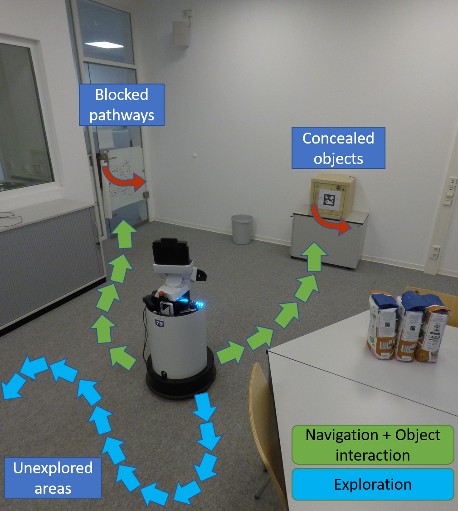
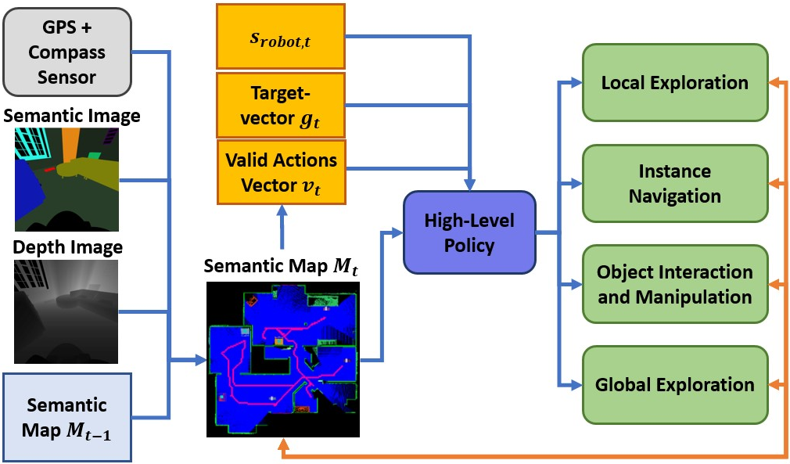
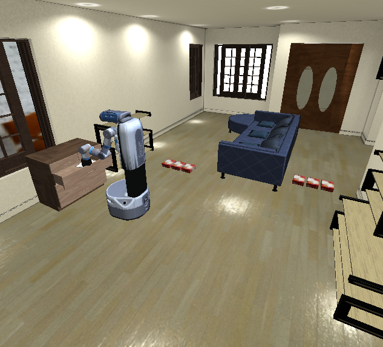
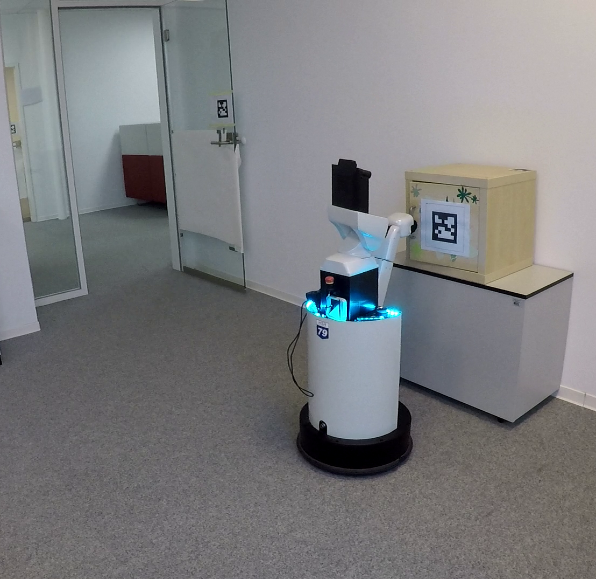

# HIMOS: Learning Hierarchical Interactive Multi-Object Search for Mobile Manipulation

Repository providing the source code for the paper "Learning Hierarchical Interactive Multi-Object Search for Mobile Manipulation", see the [project website]([http://mobile-rl.cs.uni-freiburg.de/](http://himos.cs.uni-freiburg.de)).  

  

Please cite the paper as follows:

    @article{schmalstieg2023learning,
        title={Learning Hierarchical Interactive Multi-Object Search for Mobile Manipulation},
        author={Schmalstieg, Fabian and Honerkamp, Daniel and Welschehold, Tim and Valada, Abhinav},
        journal={arXiv preprint arXiv:2307.06125},
        year={2023}
    }

## Architecture

  

## Simulation and Real-world

  
    

## Simulation Video

## Real-world Video

#### Simulation Setup
The repository uses the iGibson Simulator as well as Stable-baseline3 as external libaries. Please install iGibson==2.0.3 and Stable-baseline3==1.4.0

To train the Fetch robot, you must copy the inflated maps from the requirements folder into the respective iGibson data folders such that the robot computes feasable paths for navigation.

The iGibson dataset requires a valid license, which needs to be added manually. The corresponding link can be found here https://docs.google.com/forms/d/e/1FAIpQLScPwhlUcHu_mwBqq5kQzT2VRIRwg_rJvF0IWYBk_LxEZiJIFg/viewform.
For more information please have a look on the official website: https://stanfordvl.github.io/iGibson/dataset.html

##### Visualisation
For visualizating the egocentric maps and their corresponding static map, add the flag `show_map=true` in`config.yaml`.

#### Notes

The iGibson simulator might crash, when evaluating multiple envrionments and use the gui mode.

#### References
<a name="interactive-multi-object-search" href="https://arxiv.org/abs/2307.06125">[1]</a> Learning Hierarchical Interactive Multi-Object Search for Mobile Manipulation,
[arXiv]([https://arxiv.org/abs/2205.11384](https://arxiv.org/abs/2307.06125)https://arxiv.org/abs/2307.06125).
